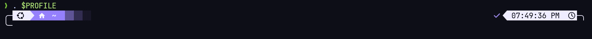
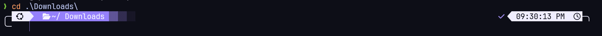

# Claude Purple — Oh My Posh Theme

A dark, purple pill-style PowerShell prompt theme for [Oh My Posh](https://ohmyposh.dev/), inspired by the terminal styling in Anthropic's *Installing Claude Code* tutorial video.

- Rounded icon + folder pill with a fading gradient trail into a dotted separator
- Conditional home/folder icon (different glyph at `~` vs. inside a project folder)
- Right-aligned status pill with checkmark + live clock
- Transient prompt support — collapses to a minimal pill once a command executes, keeping scrollback clean
- Matching Windows Terminal color scheme

## Preview





## Requirements

- [Oh My Posh](https://ohmyposh.dev/docs/installation/windows) installed
- A [Nerd Font](https://www.nerdfonts.com/) (e.g. Cascadia Code NF) installed and set in your terminal profile
- PowerShell (`pwsh` or Windows PowerShell)

## Installation

1. **Install Oh My Posh** (if you haven't already):
   ```powershell
   winget install JanDeDobbeleer.OhMyPosh -s winget
   ```

2. **Download the theme** into a permanent location, e.g.:
   ```powershell
   git clone https://github.com/<your-username>/claude-purple-theme.git "$HOME\oh-my-posh\claude-purple-theme"
   ```

3. **Point your PowerShell profile at it.** Open your profile:
   ```powershell
   notepad $PROFILE
   ```
   Add this line (create the file if prompted):
   ```powershell
   oh-my-posh init pwsh --config "$HOME\oh-my-posh\claude-purple-theme\claude-purple.omp.json" | Invoke-Expression
   ```
   Reload:
   ```powershell
   . $PROFILE
   ```

4. **Install a Nerd Font** so the icons render correctly:
   ```powershell
   oh-my-posh font install CascadiaCode
   ```
   Then set it in **Windows Terminal → your PowerShell profile → Appearance → Font face → Cascadia Code NF**.

5. **(Optional) Apply the matching terminal color scheme.** Open Windows Terminal's `settings.json` (Ctrl+, → "Open JSON file"), paste the contents of `claude-purple-terminal-scheme.json` into the `"schemes"` array, then set it as your PowerShell profile's `colorScheme`:
   ```json
   "profiles": {
     "list": [
       {
         "name": "Windows PowerShell",
         "colorScheme": "Claude Purple"
       }
     ]
   }
   ```

## Transient prompt

This theme includes a `transient_prompt` block, which Oh My Posh auto-enables for supported shells (`pwsh`, `zsh`, `fish`, `nu`, `bash` with ble.sh — not classic `cmd`). Once you run a command, the full decorated prompt collapses into a minimal pill in your scrollback.

## Customizing

All colors live in the `palette` block at the top of `claude-purple.omp.json` — change `purple`, `bg`, `icon_bg`, etc. to retheme without touching the segment logic.

To change the leading icon, swap the codepoint in the first segment's `template` field for any [Nerd Font glyph](https://www.nerdfonts.com/cheat-sheet).

## Troubleshooting

- **Icons show as boxes/question marks** → Nerd Font isn't installed or set correctly on the terminal profile.
- **No prompt bar at all, just a plain `PS C:\...>`** → check `$PROFILE` for typos in the `oh-my-posh init` line, or PSReadLine is out of date:
  ```powershell
  Install-Module -Name PSReadLine -Scope CurrentUser -Force -AllowClobber
  ```

## License

MIT — see [LICENSE](LICENSE).